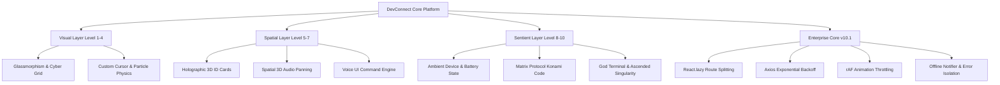

# DevConnect — Enterprise Developer Network & Spatial Platform

[](https://github.com/Suriya528/Devconnect)
[](https://react.dev/)
[](https://vitejs.dev/)
[](#system-architecture)

DevConnect is an enterprise-grade developer network platform engineered with a high-performance React architecture, spatial audio physics, ambient device state awareness, and resilient network mechanics. It bridges cutting-edge visual UX with production-ready software principles.

---

## 🏛️ Executive Summary & Architecture Highlights

DevConnect was built through an iterative **10-Level Architectural Progression**, evolving from foundational component patterns to an enterprise spatial computing platform.

### Core Architectural Pillars
- **Performance Optimization**: Route-based code splitting using `React.lazy` and `<Suspense>`, reducing initial bundle payload.
- **60 FPS Rendering Pipeline**: Mouse tracking and physical animations throttled using `requestAnimationFrame` (rAF) and `React.memo` boundary isolation.
- **Network Resilience & Circuit Breaking**: Configured `axios-retry` with exponential backoff and circuit-breaking logic to handle transient 5xx server blips and network drops cleanly.
- **Ambient Device Awareness**: Native integration with Browser Battery (`navigator.getBattery`), Network (`navigator.onLine`), Gyroscope (`DeviceOrientation`), and Speech APIs (`webkitSpeechRecognition` & `speechSynthesis`).
- **Granular Vendor Chunking**: Automated Rollup bundle splitting dividing React core, Router, Icons, and Network clients into independent cache-busting vendor chunks.

---

## 🌌 System Architecture & Level Evolution



### Architectural Capabilities Matrix

| Level | Milestone | Key Architectural Mechanics |
| :--- | :--- | :--- |
| **Level 1–4** | **Cinematic UI Foundation** | CSS Glassmorphic design system, custom trailing cursor, dynamic noise overlays, particle physics. |
| **Level 5** | **Profile Spatial Engine** | Holographic 3D tilt card, 3D CSS perspective grids, neon skill pills. |
| **Level 6** | **Prime UI & Sound Engine** | Global `Cmd+K` command palette, Web Audio API synthesized haptic audio ("ticks" & "pops"). |
| **Level 7** | **Spatial & Voice Computing** | Web Audio `StereoPannerNode` for 3D positional audio; `WebSpeech` API voice navigation engine. |
| **Level 8** | **Sentient Ambient Platform** | `speechSynthesis` AI vocal response, Battery/Network awareness (`navigator.getBattery`), physical vibration (`navigator.vibrate`), Biometric scan login. |
| **Level 9** | **Reality Distortion** | Global Konami code (`↑ ↑ ↓ ↓ ← → ← → B A`) Matrix canvas rain takeover; `DeviceOrientation` physical tilt. |
| **Level 10** | **God Level / Singularity** | Developer `GodTerminal` console (`` ` `` key trigger), Ascended White Room theme, SVG `<feDisplacementMap>` DOM warp, procedural cathedral soundscape. |
| **v10.1** | **Enterprise Hardening** | `React.lazy` code splitting, smart route prefetching, `axios-retry` circuit breaker, rAF throttling, `OfflineNotifier`, isolated Error Boundary. |

---

## 🛠️ Technology Stack

### Frontend Core
- **Framework**: [React 19](https://react.dev/) with [Vite 8](https://vitejs.dev/)
- **Routing**: [React Router 7](https://reactrouter.com/) (Data API with `createBrowserRouter` & `Suspense`)
- **Styling**: [Tailwind CSS v4](https://tailwindcss.com/) & Vanilla CSS Design Tokens
- **Icons**: [Lucide React](https://lucide.dev/)
- **Notifications**: [React Hot Toast](https://react-hot-toast.com/)

### Network & State
- **HTTP Client**: Axios with `axios-retry` (Exponential backoff & idempotent request retries)
- **Audio Synthesis**: Web Audio API (`AudioContext`, `OscillatorNode`, `StereoPannerNode`, `BiquadFilterNode`)
- **State Management**: React Context (`AuthContext`) & Custom Hooks (`useHapticAudio`, `useGyroscope`, `useKonamiCode`)

---

## 📁 Repository Structure

```
Devconnect/
├── README.md                           # Enterprise Architecture Documentation
├── backend/                            # Express/Node.js REST API Server
└── frontend/                           # React 19 / Vite Application
    ├── index.html                      # SEO Metadata & Entry Point
    ├── vite.config.js                  # Rollup Vendor Chunking & Output Strategy
    ├── src/
    │   ├── main.jsx                    # React Root Hydration
    │   ├── App.jsx                     # Route Definitions & Master Layout Shell
    │   ├── index.css                   # Core Design Tokens, Keyframe Animations, Matrix & Ascended Modes
    │   ├── api/
    │   │   └── axios.js                # Axios Instance with Resilience Interceptors
    │   ├── components/
    │   │   ├── AIOrb.jsx               # Floating AI Intelligence (Speech + Device Awareness)
    │   │   ├── CommandPalette.jsx      # Cmd+K Modal Navigation
    │   │   ├── CustomCursor.jsx        # Trailing Cursor Engine (rAF Throttled)
    │   │   ├── ErrorBoundary.jsx       # Isolated Diagnostic Recovery Boundary
    │   │   ├── GodTerminal.jsx         # Fullscreen Developer CLI Console
    │   │   ├── HolographicCard.jsx     # 3D Tilt ID Card (rAF & Gyroscope Supported)
    │   │   ├── MatrixRain.jsx          # HTML5 Canvas Digital Rain Engine
    │   │   ├── Navbar.jsx              # Responsive Navigation Bar
    │   │   ├── OfflineNotifier.jsx     # Network Connectivity Loss Banner
    │   │   └── PageLoader.jsx          # Suspense Fallback Loader
    │   ├── hooks/
    │   │   ├── useGyroscope.js         # Physical Device Tilt Parallax
    │   │   ├── useHapticAudio.js       # Spatial 3D Positional & Generative Audio
    │   │   └── useKonamiCode.js        # Secret Sequence Detector
    │   ├── pages/                      # Lazy Loaded Route Views
    │   │   ├── Dashboard.jsx
    │   │   ├── DeveloperProfile.jsx
    │   │   ├── Feed.jsx
    │   │   ├── Home.jsx
    │   │   ├── Login.jsx
    │   │   ├── ProfilePage.jsx
    │   │   ├── Register.jsx
    │   │   └── SearchPage.jsx
    │   └── utils/
    │       └── routePrefetch.js        # Hover-Based Dynamic Route Prefetcher
```

---

## 🚀 Local Setup & Installation

### Prerequisites
- **Node.js**: `v18.0.0` or higher
- **npm**: `v9.0.0` or higher

### 1. Clone & Install Dependencies
```bash
git clone https://github.com/Suriya528/Devconnect.git
cd Devconnect/frontend
npm install
```

### 2. Configure Environment Variables
Create a `.env` file in `frontend/`:
```env
VITE_API_URL=http://localhost:5000
VITE_GITHUB_CLIENT_ID=your_github_client_id
```

### 3. Run Local Development Server
```bash
npm run dev
```
The application will launch locally at `http://localhost:5173` (or next available port).

---

## ⚡ Build & Bundle Performance Benchmarks

Executing `npm run build` compiles the application with optimal chunk isolation:

```bash
dist/index.html                             0.94 kB │ gzip:   0.44 kB
dist/assets/index-4n91DK42.css             94.46 kB │ gzip:  14.31 kB
dist/assets/Dashboard-DF2Q8_Jk.js          12.90 kB │ gzip:   3.63 kB
dist/assets/feed-C_oEuH1B.js               19.12 kB │ gzip:   5.61 kB
dist/assets/ProfilePage-C5cnXjBh.js        27.63 kB │ gzip:   7.51 kB
dist/assets/vendor-CbQsWyoH.js             41.20 kB │ gzip:  12.87 kB
dist/assets/network-vendor-DilpT2lG.js     48.33 kB │ gzip:  18.38 kB
dist/assets/react-vendor-BfFUVDmT.js      310.64 kB │ gzip: 100.20 kB

✓ Built production assets in ~1.91s
```

---

## 🔒 Security & Best Practices

- **Authentication**: JWT-based authorization attached via request interceptors; auto-purged on 401 response statuses.
- **XSS Prevention**: Sanitized outputs and React virtual DOM escaping.
- **Error Shielding**: Component exceptions isolated by `ErrorBoundary` to prevent white-screen crashes.
- **Resource Cleanup**: All event listeners (`mousemove`, `keydown`, `deviceorientation`, `online/offline`) implement explicit teardown inside `useEffect` cleanup routines.

---

## 📄 License & Attribution

Designed & Developed with high-precision engineering by **Suriya** & **Antigravity AI**.
Licensed under the [MIT License](LICENSE).
